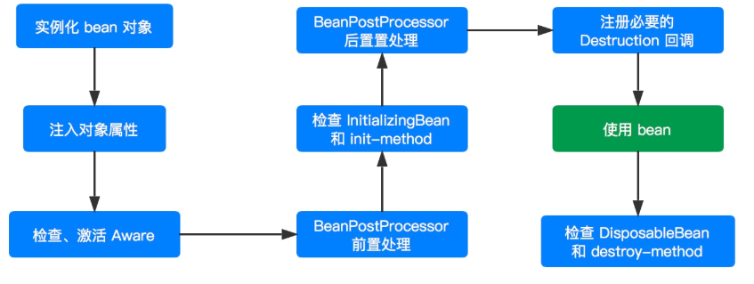

# 生命周期

在分析 Spring Bean 实例化过程中提到 Spring 并不是一启动容器就开启 bean 的实例化进程，只有当客
户端通过显示或者隐式的方式调用 BeanFactory 的 #getBean(...) 方法来请求某个实例对象的时候，它
才会触发相应 bean 的实例化进程。当然，也可以选择直接使用 ApplicationContext 容器，因为该容器
启动的时候会立刻调用注册到该容器所有 bean 定义的实例化方法。当然，对于 BeanFactory 容器而言，
并不是所有的 #getBean(...) 方法都会触发实例化进程，比如 singleton 类型的 bean，该类型的 bean
 只会在第一次调用 getBean() 的时候才会触发，而后续的调用则会直接返回容器缓存中的实例对象。

context #getBean(...) 方法，只是 bean 实例化进程的入口，真正的实现逻辑其实是在 AbstractAutowireCapableBeanFactory 的 #doCreateBean(...) 中实现，实例化过程如下图：

原来我们采用 new 的方式创建一个对象，用完该对象在其脱离作用域后就会被回收，对于后续操作我们无权也没法干涉，但是采用 Spring 容器后，我们完全摆脱了这种命运，Spring 容器将会对其所有管理的 Bean 对象全部给予一个统一的生命周期管理，同时在这个阶段我们也可以对其进行干涉（比如对 bean 进行增强处理，对 bean 进行篡改），如上图。
